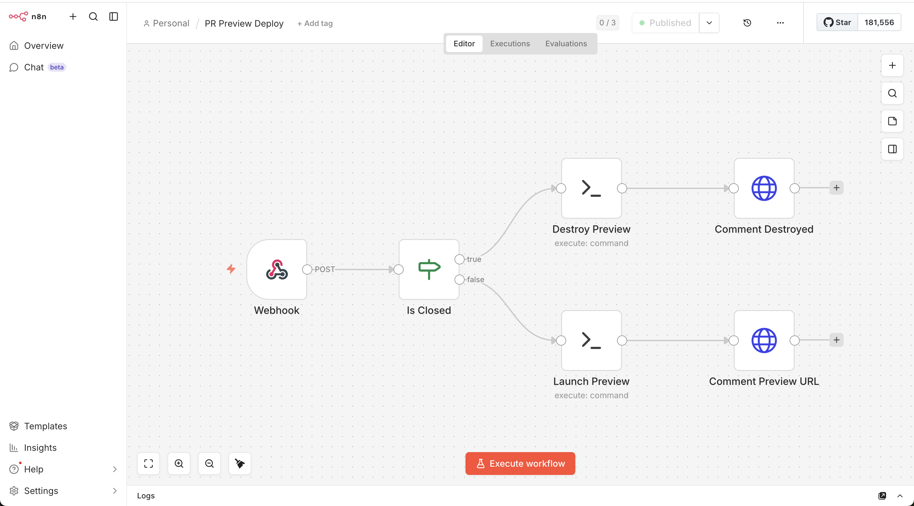
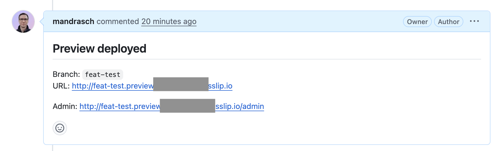

# Craft CMS Preview System

Write a ticket with a markdown spec. An AI agent picks it up, creates a branch, implements the changes, opens a PR, and spins up a live preview environment — ready for human feedback.

That's the goal. Right now, the preview infrastructure is working: open a PR and a full Craft CMS environment is deployed automatically.

> **Experimental.** ⚠️ Built with [Claude Code](https://claude.com/claude-code) via SSH on a bare Hetzner server. Learning reference, not production-ready. Do not run on servers with sensitive data. No liability, use at your own risk.

## Screenshots

**n8n workflow** — Webhook → IF (closed?) → Launch or Destroy → Post PR comment



**PR comment** — Preview URL posted automatically when the environment is ready



## Vision

```
                        ┌─────────────────────────────┐
                        │  TODAY                       │
                        │                              │
  PR opened on GitHub ──┤  1. n8n receives webhook     │
                        │  2. Clones branch            │
                        │  3. composer install         │
                        │  4. Creates DB + Craft CMS   │
                        │  5. Boots preview container  │
                        │  6. Posts URL as PR comment   │
                        │                              │
  PR closed ────────────┤  7. Destroys container + DB  │
                        └─────────────────────────────┘

                        ┌─────────────────────────────┐
                        │  FUTURE                      │
                        │                              │
  Ticket created ───────┤  1. AI agent reads spec      │
  (GitHub Issue /       │  2. Creates branch           │
   Linear / etc.)       │  3. Implements changes       │
                        │  4. Opens PR                 │
                        │  5. Preview auto-deploys     │
                        │  6. Human reviews + comments │
                        │  7. Agent iterates on        │
                        │     feedback if needed       │
                        └─────────────────────────────┘
```

Each preview gets its own subdomain: `reponame-pr-21.preview.SERVER_IP.sslip.io`

## Stack

- **Hetzner CAX31** — ARM64, Ubuntu 24.04
- **Traefik** — reverse proxy, routes subdomains to containers
- **MySQL 8.0** — shared instance, one database per preview
- **n8n** — webhook receiver + orchestration (runs scripts via SSH)
- **craftcms/nginx:8.2** — one container per preview branch
- **sslip.io** — wildcard DNS from IP, no domain needed

## Current Status

**Preview infrastructure works end-to-end.** Open a PR → preview deploys → URL posted as comment.

- Clone, composer install, database creation, Craft install, container boot
- Traefik routing with sslip.io wildcard DNS (plain HTTP)
- Auto-generated security key and admin credentials from `.env`
- Teardown on re-push (synchronize) and PR close

**TODO:**
- [ ] Switch trigger from PR to ticket/issue creation
- [ ] Auto-create branch + PR from ticket spec
- [ ] Integrate AI agent (Claude Code) to implement changes from the ticket spec
- [ ] Agent reads PR/issue comments as feedback, pushes follow-up commits
- [ ] Preview auto-rebuilds on each push

**Known issues:**
- Traefik may need a restart after first container launch if it returns 504

## Setup

> See `CLAUDE.md` for the full step-by-step guide (phases 1–12).

### 1. Provision a server
- Hetzner CAX31 (ARM64, Ubuntu 24.04) or similar
- SSH key auth: `ssh-copy-id root@YOUR_IP`

### 2. Configure
- Copy `.env.example` to `.env` and fill in your values
- Public repos: HTTPS clone URL — no deploy key needed
- Private repos: SSH clone URL + deploy key (see CLAUDE.md Phase 10)

### 3. Run the setup
- Follow `CLAUDE.md` phases 1–12, or hand it to Claude Code and let it SSH in

### 4. Set up n8n
- Open `http://n8n.preview.YOUR_IP.sslip.io/` and create an account
- Import `n8n-workflow-preview-deploy.json`
- Manually connect the IF node outputs (n8n import bug)
- Add a **GitHub API** credential (fine-grained token with Issues + PR write access)
- Select the credential on both HTTP Request nodes
- Activate the workflow

### 5. Add the GitHub webhook
- Repo → Settings → Webhooks → Add webhook
- **Payload URL:** `http://n8n.preview.YOUR_IP.sslip.io/webhook/preview-deploy`
- **Content type:** `application/json`
- **Events:** Pull requests only

### 6. Test it
- Open a PR → preview URL appears as a comment
- Close the PR → preview is destroyed
